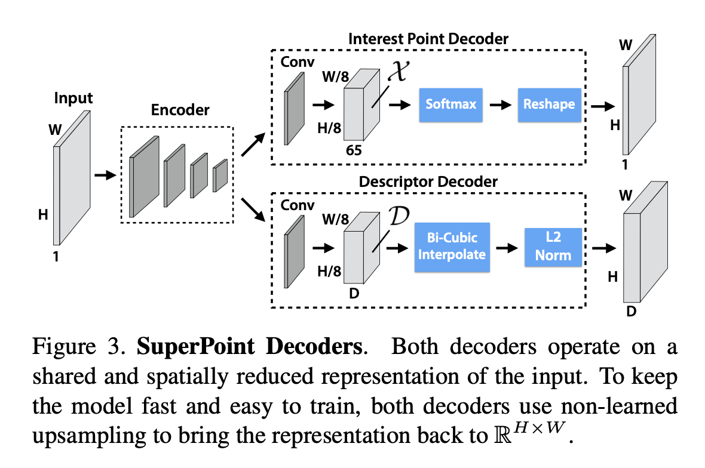
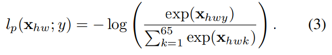
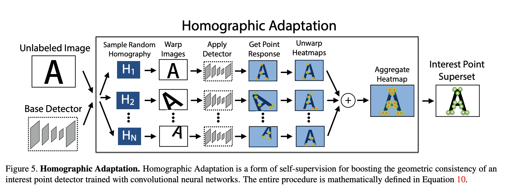

------

# SuperPoint: Self-Supervised Interest Point Detection and Description

## 3. SuperPoint Architecture

### Innovation

Most of the network’s parameters are shared between the two tasks, which is a departure from traditional systems which first detect interest points, then compute descriptors and lack the ability to share computation and representation across the two tasks.

## DataSet

- MS-COCO

MS COCO (Microsoft Common Objects in Context) is a large-scale image recognition and scene understanding dataset for computer vision. It was created by Microsoft Research and contains over 330,000 images with 2.5 million object instances labeled with 80 object categories, including common objects such as people, animals, furniture, and vehicles.

# 3. SuperPoint Architecture

### **3.1. Shared Encoder(VGG-style)**

- Consist with convolutional layer and spatial downsampling via pooling and non-linear activation functions
  - Use convolution layers to extract the feature of the image
    - Convolution size: $H_c = H/8, \ W_c = W/8$ for image size $W \cdot H$
    - Produce  $8\times8$ cells
  - Use $2\times 2$ non-overlapping max pooling operation in 64 cells
    - Function: extract the edges
- Function: Use to reduce the demensionality of the image

Input$(R^{W\times H})$ → Output$(R^{W_C \times H_C \times 64})$

- The encoder maps the input image $I ∈ R^{H×W}$ to an intermediate tensor $B ∈ R^{H_c×W_c×65}$$B ∈ R^{H_c×W_c×F}$ with smaller spatial dimension and greater channel depth  $(i.e., H_c < H, W_c < W\ and\ F > 1).$

### 3.2 **Interest Point Decoder**

Inputs $(R^{W_C \times H_C \times 65})$ → Output$(R^{W\times H})$

- 65 chanel correspond to
  - local non-overlapping 8*8 grid regions of pixels
  - extra “no interest point” dustbin
- Then apply a chanel-wise softmax activation function
- The dusbin chanel is removed$(R^{W_C \times H_C \times 65}) \rightarrow (R^{W \times H} \times 64)$
- Dusbin
  - In SuperPoint, the "dusbin" refers to the dual SuperPoint binarization. It is a technique used in the algorithm to improve the robustness of the keypoint extraction process.
  - In computer vision, the keypoint extraction process is used to identify and describe distinctive points in an image that are invariant to geometric and photometric transformations. To achieve this, the SuperPoint algorithm uses a combination of a feature extractor network and a descriptor network, both trained end-to-end on a large dataset of images.
  - The dual SuperPoint binarization is used to improve the robustness of the feature extractor network by creating two separate binary maps from the activations of the network. These binary maps are then combined to form a final binary map that is used to identify the keypoints in the image. The use of the dual SuperPoint binarization allows the algorithm to better handle changes in viewpoint, illumination, and partial occlusion, making it more robust and effective in a variety of real-world scenarios.

- $**R^{W_C \times H_C \times 64}\rightarrow R^{W \times H}**$
  - each pixel of the output corresponds to a probability of “point-ness” for that pixel in the input. Once the probability exceed a threshold, the pixiel will be detected as a interest point.

### 3.3 Descriptor Decoder

- The descripor head will output a Tensor which  has $R^{\mathcal{H_c\times W_c \times D}}$ . In this paper, the author sets $\mathcal{D} = 256$.
- Bicubic interpolation

[最近邻插值、双线性插值与双三次插值](https://zhuanlan.zhihu.com/p/428523385)

### 3.4 Loss Function

[Notes on SuperPoint](https://zhuanlan.zhihu.com/p/54969632)

- it is consisted with 2 part:

  - Formula

  $$
  \mathcal{L}_(\mathcal{X,X',D,D';Y,Y',S})=\\\mathcal{L_p(X,Y)+L_p(X',Y')+\lambda L_d(D,D',S)}
  $$

  - $\lambda$ is used to balance the final loss

- Interest point detector loss function

  - Cross-entropy loss:

  [Cross-Entropy Loss Function](https://towardsdatascience.com/cross-entropy-loss-function-f38c4ec8643e)

  - Formula
  - where $t_i$ is the truth label and $p_i$ is the softmax probability for $i^{th}$ class

  $$
  H(P,Q) = -\sum_{\mathcal{x =1}}t(x)log\ p(x)
  $$

  - For example
  - expected output: [1,0], model output: [0.7, 0.3]

  $$
  H(P,Q) = -(1\times log0.7)-(0\times log0.3) = -log0.7 = 0.15490195998
  $$

  - In SuperPoint model

    - Softmax and cross entropy in a cell $h*w$

      

  - Descriptor loss

  - The descriptor loss is applied to all pairs ]of descriptor cells, $d_{hw} \in D$ from the first image and $d ’_{h’w’}$ ∈ D0 from the second image.

  - The contrastive loss can be expressed mathematically as:

  $$
  ⁍
  $$

  - GPT explaination

  The loss function in SuperPoint is a measure of the difference between the predicted keypoints and descriptors and the ground-truth annotations. The loss function is used to guide the training process of the feature extractor and descriptor networks, so that the network parameters are optimized to minimize the difference between the predicted and ground-truth keypoints and descriptors.

  There are two main components to the loss function in SuperPoint: the keypoint loss and the descriptor loss.

  1. Keypoint loss: The cross-entropy loss is a commonly used loss function in supervised learning problems, where the goal is to classify the input data into one of several categories. In the case of SuperPoint, the keypoint loss is used to classify each pixel in the image as either a keypoint or a non-keypoint.

     $L_{keypoint} = -\frac{1}{N} \sum_{i=1}^{N} [y_i \log(p_i) + (1 - y_i) \log(1 - p_i)]$

     where N is the number of pixels in the image, y_i is the ground-truth label for pixel i (1 for keypoint, 0 for non-keypoint), and p_i is the predicted probability that pixel i is a keypoint.

     where N is the number of keypoints, $p_i$ is the ground-truth keypoint position, and $p'_i$ is the predicted keypoint position. The keypoint loss is typically a mean squared error (MSE) loss, which measures the average squared difference between the predicted and ground-truth keypoints.

  2. Descriptor loss: The descriptor loss is a measure of the difference between the predicted descriptors and the ground-truth descriptors. The descriptor loss can be expressed mathematically as:

     $L_{descriptor} = \frac{1}{N} * sum_{i=1}^{N} ||d_i - d'_i||^2,$

     where N is the number of keypoints, $d_i$ is the ground-truth descriptor, and $`d'_i`$ is the predicted descriptor. The descriptor loss is also typically a MSE loss, which measures the average squared difference between the predicted and ground-truth descriptors.

  The total loss function in SuperPoint is a combination of the keypoint loss and the descriptor loss:

  $$
  L = L_{keypoint} + L_{descriptor}
  $$

  The network parameters are optimized to minimize the total loss function during the training process, so that the predicted keypoints and descriptors are as close as possible to the ground-truth annotations. The optimization process can be performed using gradient descent or another optimization algorithm, such as Adam or SGD.

- mAP(mean of Average precision)

Mean Average Precision (mAP) is a common evaluation metric used in object detection and image retrieval tasks in computer vision. mAP measures the average precision of a model over a set of images, where precision is defined as the ratio of true positive detections to the total number of positive detections (true positive and false positive).

The formula for mAP is defined as:

$mAP = \frac{1}{Q} \sum_{q=1}^{Q} \frac{1}{|D_q|} \sum_{k=1}^{|D_q|} \text{Precision}(k) \cdot [\text{Rel}(k) = 1]$

where $Q$ is the number of query images, $D_q$ is the set of ground-truth bounding boxes for query image $q$, $|D_q|$ is the number of ground-truth bounding boxes in $D_q$, $\text{Rel}(k)$ is a binary variable indicating whether the $k$-th prediction is a true positive (1) or not (0), and $\text{Precision}(k)$ is the precision of the first $k$ predictions.

The precision of the first $k$ predictions is defined as the ratio of the number of true positive detections to the total number of positive detections (true positive and false positive) up to the $k$-th prediction:

$\text{Precision}(k) = \frac{\sum_{i=1}^{k} [\text{Rel}(i) = 1]}{k}$

mAP provides a single scalar value that summarizes the performance of a model on a set of images, and it is widely used in computer vision benchmarks, such as the PASCAL VOC and MS COCO datasets, to compare the performance of different models. A higher mAP value indicates a higher level of accuracy and recall in object detection and image retrieval tasks.

- Repeatability

Repeatability is typically expressed as a percentage of correctly detected and described keypoints. Given a set of images of the same scene, the repeatability $R$ can be calculated as:

$R = \frac{\sum_{i=1}^{n} N_{correct}^i}{\sum_{i=1}^{n} N_{total}^i} \times 100%$

where $n$ is the number of images in the set, $N_{correct}^i$ is the number of correctly detected and described keypoints in image $i$, and $N_{total}^i$ is the total number of keypoints detected in image $i$.

The calculation of repeatability involves the comparison of keypoints and descriptors across multiple images of the same scene, and it typically uses a distance metric, such as the Euclidean distance, to compare the descriptors of keypoints in different images. A threshold value is used to determine whether a keypoint is considered correctly detected and described, based on the distance between the descriptors of the keypoint in different images.

## NMS(Non-Maximum Suppression)

Non-Maximum Suppression (NMS) is a technique used in computer vision to reduce the number of detections of an object in an image, while preserving the highest-scoring detections. NMS is typically used in object detection algorithms to remove overlapping bounding boxes that correspond to the same object, so that each object is represented by a single detection.

The basic idea behind NMS is to keep the highest-scoring detection and remove all other detections that have a high overlap with the highest-scoring detection. The overlap between two bounding boxes is typically measured using the Intersection over Union (IoU) metric, which is defined as:

$\text{IoU}(A, B) = \frac{\text{area}(A \cap B)}{\text{area}(A \cup B)}$

where $A$ and $B$ are two bounding boxes, and $\text{area}(\cdot)$ is the area of a bounding box. The IoU metric measures the overlap between two bounding boxes as the ratio of their intersecting area to their union area.

NMS works by first selecting the highest-scoring detection, and then removing all other detections that have an IoU with the highest-scoring detection greater than a threshold value $t$. The process is repeated until all detections have been processed.

NMS is an important technique in object detection algorithms because it helps to reduce the number of false positive detections and to improve the accuracy of the detections. By removing overlapping detections, NMS helps to ensure that each object is represented by a single, high-scoring detection, which is important for tasks such as object tracking and recognition.

## 5. Homographic adaptation

Homographic adaptation is a technique used in the SuperPoint algorithm to align keypoints across multiple images taken from different viewpoints. The technique uses a homography matrix to map one image to the other, so that corresponding keypoints in the two images are aligned.

In SuperPoint, the homography matrix is estimated from a set of corresponding keypoints, and it is used to align the keypoints in the two images. The aligned keypoints are then used to compare the descriptors of the keypoints, and to determine whether they correspond to the same feature in the two images.

The homography matrix can be estimated using a variety of methods, including the RANSAC (Random Sample Consensus) algorithm, which is a robust estimation technique that can handle outliers and noisy data. The RANSAC algorithm randomly selects a set of corresponding keypoints, and it estimates the homography matrix that best aligns the keypoints. The algorithm is repeated multiple times, and the homography matrix that results in the highest number of inliers (correctly aligned keypoints) is selected.

Once the homography matrix has been estimated, it can be used to align the keypoints in the two images, by transforming the keypoints in one image using the homography matrix. The aligned keypoints can then be used to compare the descriptors of the keypoints, and to determine whether they correspond to the same feature in the two images.

Homographic adaptation is an important step in the SuperPoint algorithm, as it allows the algorithm to align keypoints across multiple images taken from different viewpoints, which is important for tasks such as object detection, recognition, and structure-from-motion. The technique is robust and can handle a range of geometric and photometric transformations, such as rotations, scalings, and changes in illumination and exposure.

## Average response

The average response of a feature detector or keypoint descriptor is calculated as the mean value of the response or activation values over a set of feature detectors or keypoint descriptors.

Mathematically, the average response $R_{avg}$ can be expressed as:

$R_{avg} = \frac{1}{N} \sum_{i=1}^{N} R_i$

where $N$ is the number of feature detectors or keypoint descriptors in the set, and $R_i$ is the response or activation value of the $i^{th}$ feature detector or keypoint descriptor.

The average response is a simple and effective metric for evaluating the performance of feature detection and description algorithms, and it provides a measure of the overall quality of the features and descriptors. A higher average response indicates a higher quality of the features and descriptors, and it is an important factor to consider in the selection and comparison of feature detection and description algorithms for computer vision applications.

